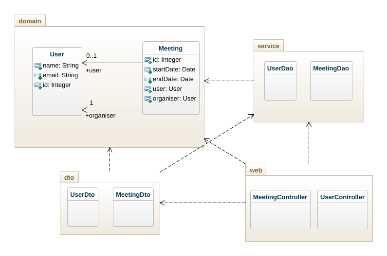

# TP3 Spring

###### Stefan Locke

Pour lancer le front, vous pouviez soit utiliser docker :

```
git clone https://github.com/StefanLocke/tptaafront.git
cd tptaafront
docker build -t front .
docker run -p 3000:80
```
ou avec npm :
```
git clone https://github.com/StefanLocke/tptaafront.git
cd tptaafront
npm run 
```
Et visiter ```localhost:3000``` pour y avoir accès.

Pour lancer le back, j'ai essayé d'utiliser docker, 
mais j'ai passé beaucoup trop de temps a essayé de configurer Maven et docker pour qu'ils marchent, mais sans succès.
Donc il faut passer par IntelliJ.

De mon cote tout marchait bien, sans bug (a priori), c'est juste dommage que je n'ais pas réussit a configuré pour docker

---

#### Implémentation et API

Ce backend , base sur le TP1, est un service "doctolib" qui permet a des docteur/professionnel a posé des créneaux de rendez-vous, qui peuvent être "pris" par des client.

Pour simplifier légèrement l'application, authentication et les rôles n'on pas été implémenté. Ceci permet donc a n'importe qui de créer des créneaux de rendez-vous.

L'api est donc très simple et peut être divise en deux sections :

##### User : 

- `user/create` Cree un nouveau user
- `user/delete?id=x` Delete un user avec l'id donné (Faut faire attention si un utilisateur fait parti d'un meeting!)
- `user/update?id=x&name=y&email=z`Met a jour un user avec le nom et email donne
- `user/get-by-email/{email}` Rend un utilisateur a partir d'un email
- `user/get?id=x` Rend un utilisateur a partir d'un id
- `user/all` Rend touts les user

##### Meeting : 

- `meeting/create?userId=x&startTime=y&endTime=z` Cree un nouveau meeting a partir de l'id du créateur, d'une date de début et de fin.
- `meeting/delete?meetingId=x` Delete un meeting a partir d'un id
- `meeting/join?meetingId=x&userId=y` Cause un user a joindre un meeting, ne marche pas si s'utilisateur donne est le créateur
- `meeting/leave?meetingId=x%userId=y` Cause un user a leave un meeting, ne marche pas si s'utilisateur donne est le créateur
- meeting/all Rend touts les meeting

Ceci est assez pour avoir un service fonctionnel.
#### Front

Pour créer le front le mon service, j'ai utilisé React.
Je m'excuse pour sa mocheté :)

La landing page est une page ou vous pouvez soit crée un utilisateur, soit en delete un.

Une fois des utilisateurs crée, vous pouvez cliquer sur leurs noms pour accéder au "Dashboard"

Ici vous pouviez créer des meetings (Pas implémentation de sélection d'heure, trop de problèmes avec les librairies), en rejoindre, en quitte, et en delete.

Vous pouviez aussi soit "logout", ou allez mettre a jour le profil.

#### Librairie

- Spring Data :

  Spring data nous permet de ne pas devoir implémenter les classes DAO faite pendant le TP2. Il nous permet aussi de créer de nouvelle query "custom", mais vu la simplicité du service, ceci n'est pas nécessaire.

- Lombok
Lombok permet l'annotation de classes avec @Getters @Setters ect.. qui en plus de Spring data, reduit le nombre de lignes de code a écrire.

- Spring
Les classes ressource vus au TP2 ne sont plus nécessaire avec cette librairie. Une foi un contrôleur annoté avec @RestController, le Framework spring arrive à bien les "wire".

J'ai aussi utilisé des DTO, qui sont intermédiaire entre les objets du domain dans le back et les objets envoyer au front. Dans cette implémentation, les DTO ne sont pas très utiles, puisqu'ils ont la même structures que leurs classes domain.

#### BDD

La base de donne peut soit être extérieur avec une BDD MySQL ect, ou elle peut être interne. En utilisant la ressource de configuration de l'application, spring peut lancer sa propre base de donnée HSQLDB.

#### UML

La structure est assez simple et auto explicative



Pour voir implémentation du TP 2 Kaban voir :
https://github.com/StefanLocke/JaxRSOpenAPI.git


 projet n'a pas re README.


